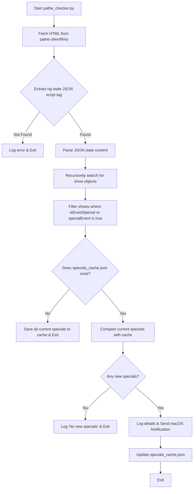

# Pathé Specials Checker

A robust Python script that monitors the Pathé Netherlands (English) website for special event movie releases, caches current offerings, and sends macOS desktop notifications when new specials are detected.

---

## Features

- **Angular State Parsing**: Fetches and parses the JSON state data embedded in the Pathé NL films page (`https://www.pathe.nl/en/films`).
- **Recursive Movie Search**: Dynamically extracts show details from the nested state tree.
- **Specials Filtering**: Screens movies using `isEventSpecial` and `specialEvent` attributes.
- **Local Caching**: Saves detected specials to a cache JSON to prevent duplicate alerts.
- **macOS Desktop Notifications**: Uses AppleScript (`osascript`) to send native desktop alerts for newly found specials.
- **Flexible Configuration**: Supports custom workspace paths, dry runs, cache clearing, and custom URLs via a robust CLI.
- **Testing**: Includes a comprehensive test suite to verify HTML parsing, recursive filtering, and dry-run boundaries.

---

## Requirements

- **Operating System**: macOS (required for desktop notifications via AppleScript/`osascript`).
- **Python Version**: Python 3.8 or higher.
- **Dependencies**: Only Python standard library modules are used:
  - `urllib.request` (fetching the website)
  - `re` (extracting JSON state block)
  - `json` (parsing and storing data)
  - `subprocess` (executing AppleScript notifications)
  - `datetime` / `sys` / `os` / `argparse` (logging, CLI handling, and file path manipulation)

---

## Project Structure

```text
pathe/
├── .github/
│   └── workflows/
│       └── pathe_checker.yml # GitHub Actions workflow automation
├── .gitignore          # Ignores local data cache, logs, and python bytecode
├── pyproject.toml      # Package setup and metadata (PEP 621 compliant)
├── requirements.txt    # Lists dependencies (development dependencies)
├── README.md           # Documentation
├── pathe_checker.py    # Main script executable
└── tests/
    └── test_pathe_checker.py   # Unit tests with mock HTML/JSON state data
```

---

## Workflow Details



---

## CLI Usage and Configuration

By default, the script stores logs (`pathe_checker.log`) and cache (`specials_cache.json`) in a local `data/` subdirectory relative to the script location.

### Command Line Flags

You can customize execution by running `pathe_checker.py` with flags:

```bash
options:
  -h, --help            show this help message and exit
  -w WORKSPACE, --workspace WORKSPACE
                        Base directory for the project (defaults to script directory)
  -d, --dry-run         Run scraping and detection without updating cache or sending alerts
  --clear-cache         Delete the cached specials file before checking
  --url URL             Pathé URL to scrape
```

---

## How to Run

### Manual Execution

1. Ensure the script is executable:
   ```bash
   chmod +x pathe_checker.py
   ```
2. Run a dry run to check what movies would be detected:
   ```bash
   ./pathe_checker.py --dry-run
   ```
3. Run a normal check:
   ```bash
   ./pathe_checker.py
   ```

### Automation (Crontab)

To check for specials automatically (e.g., every 3 hours), you can add a cron job locally on macOS:

1. Open your crontab manager:
   ```bash
   crontab -e
   ```
2. Add a line to run the script (specifying your python3 path and absolute path to the script):
   ```cron
   0 */3 * * * /usr/bin/python3 /Users/franklinamorim/Antigravity/pathe/pathe_checker.py
   ```

### Automation (GitHub Actions & ntfy.sh)

The project includes a pre-configured GitHub Actions workflow in `.github/workflows/pathe_checker.yml` that runs every 3 hours. It uses `ntfy.sh` to send push notifications to your phone/desktop.

#### Configuration:
1. **GitHub Secret:** Add your custom ntfy.sh topic name as a repository secret named `NTFY_TOPIC`.
2. **Cloudflare Bypass:** Add a free ScraperAPI key as a repository secret named `SCRAPERAPI_KEY` to bypass Cloudflare protection.
3. **Cache Persistence:** The workflow automatically commits the updated `data/specials_cache.json` cache file back to the repository branch when new releases are detected.

---

## Running Unit Tests

A mock-based test suite is included under `tests/` to verify correctness. To run it:

```bash
python3 -m unittest discover -s tests -v
```
